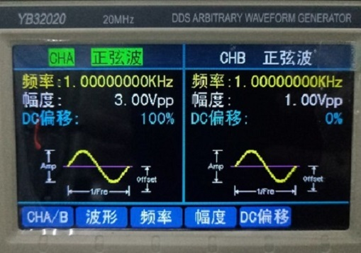
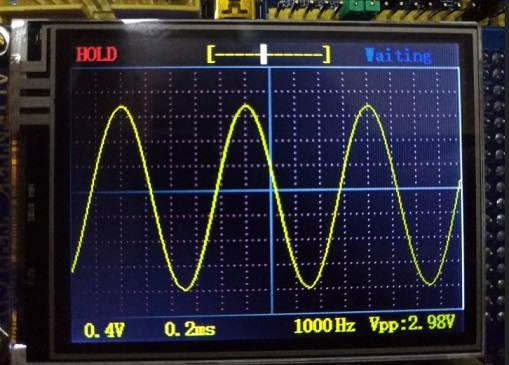
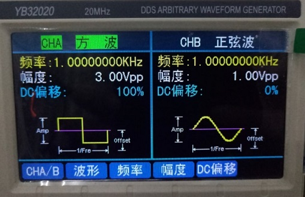
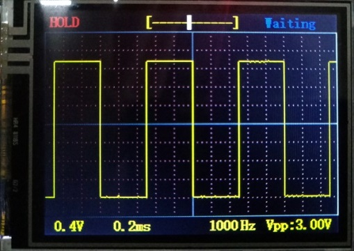
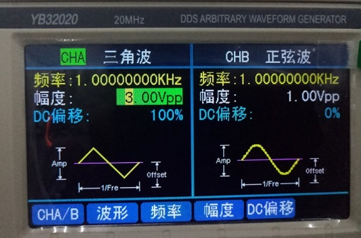
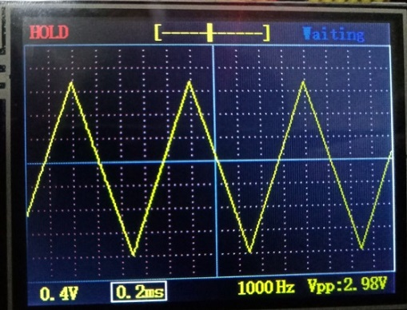

# 一、项目简介
&ensp; &ensp; 这是STM32CubeMX + HAL库的代码，标准库的在这里：https://gitee.com/hanxiaohu/stm32_Oscilloscope

&ensp; &ensp; 19年时嵌入式课程设计作品，使用的是正点原子ALIENTEK MiniSTM32开发板。只使用了一个开发板，示波器没有设计前端模拟电路，只能测量正电压波形。

&ensp; &ensp; 标准库版本将STM32F103RC超频到了112M运行，目测可以达到30FPS刷新（没有准确计算过），未超频的应该也有十几FPS的刷新率，外设使用了ADC+DMA+TIMER配合，使用TIM3的TRGO事件来触发ADC采样，改变TIM3的频率就是改变采样频率。同时利用其他外设实现了简单的信号发生器功能以方便测试示波器的效果，在PA3输出方波，PA4输出三角波，PA5输出正弦波，均为1KHZ频率。

# 二、效果测试
## 1.信号发生器设置输出正弦波(CHA)，频率1KHz，幅度3.00Vpp，DC偏移100%
- 

- 

------

## 2.信号发生器设置输出方波(CHA)，频率1KHz，幅度3.00Vpp，DC偏移100%
- 

- 

------

## 3.信号发生器设置输出三角波(CHA)，频率1KHz，幅度3.00Vpp，DC偏移100%
- 

- 
